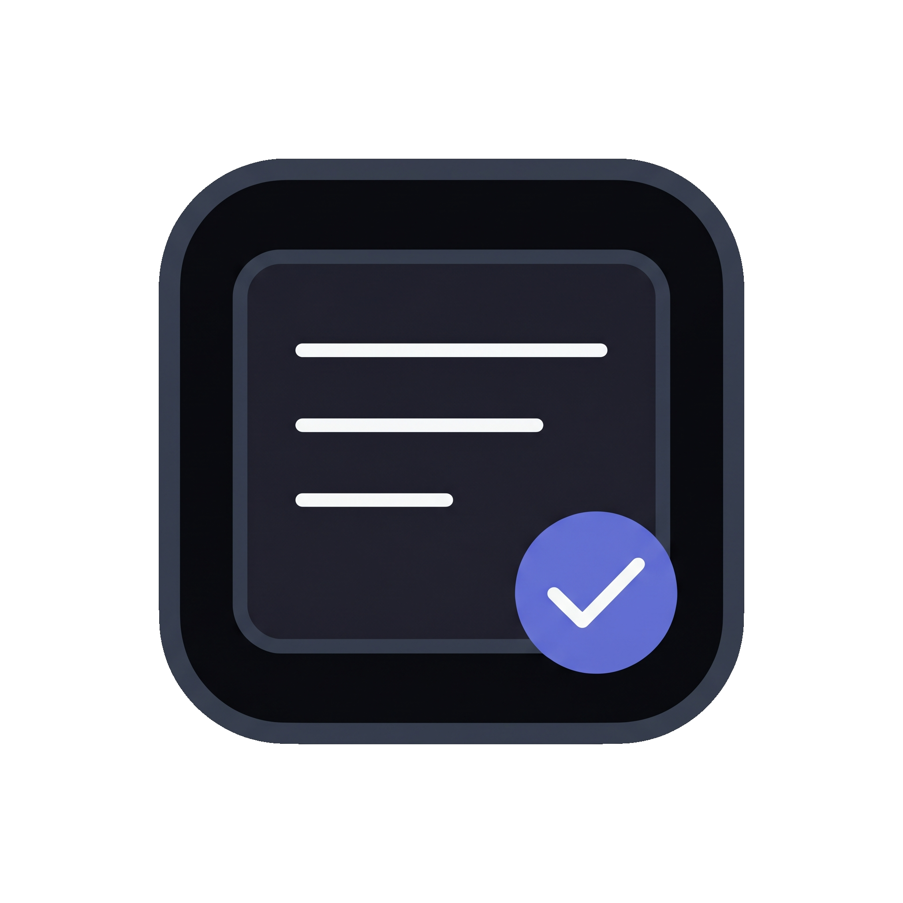
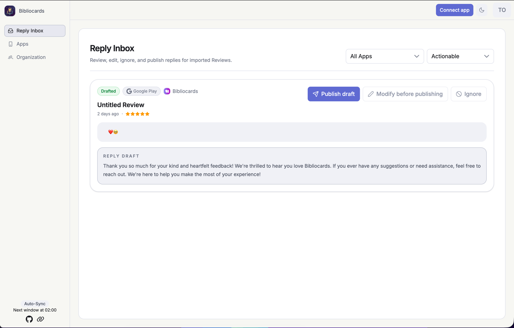
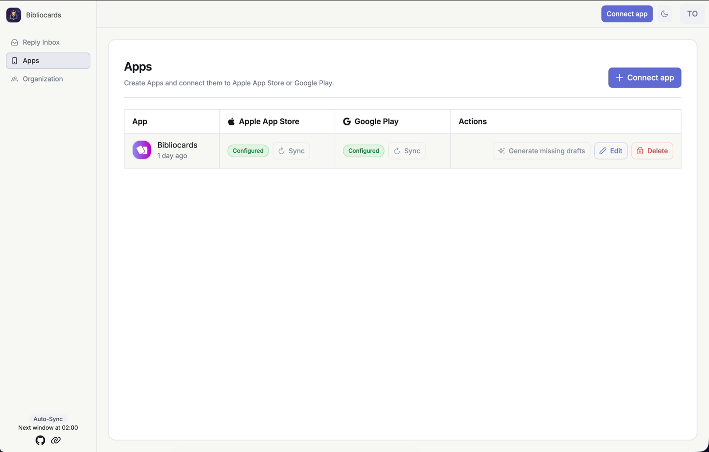
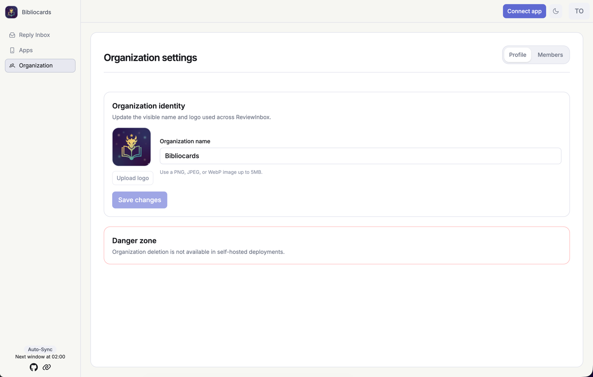

<p align="center">
  
</p>

# ReviewInbox

ReviewInbox is an open-source reply inbox for App Store and Google Play reviews. It imports reviews, drafts replies with AI, keeps humans in control, and helps teams turn recurring review pain into product insight.

ReviewInbox is not a feedback board. It reads existing public store reviews and turns them into replies, patterns, and actions.

Marketing site: <https://reviewinbox.app>

## Screenshots







## What It Does

- Import App Store and Google Play reviews.
- Generate AI Reply Drafts automatically when AI drafting is configured.
- Let a human edit, ignore, or publish each reply.
- Keep workflow and publishing history.
- Support multiple Apps per Organization.
- Turn recurring review pain into weekly product insight as the inbox workflow matures.

## Status

ReviewInbox is in early alpha. The Docker Compose setup is the intended self-hosted deployment path, and the docs will stay aligned as the product hardens.

## Self-Hosting

The recommended self-hosted setup uses pinned Docker images and Docker Compose:

- `ghcr.io/bibliocards/reviewinbox-api:${REVIEWINBOX_VERSION}`
- `ghcr.io/bibliocards/reviewinbox-web:${REVIEWINBOX_VERSION}`
- `ghcr.io/bibliocards/reviewinbox-worker:${REVIEWINBOX_VERSION}`
- Postgres 18

Quick start on a VPS:

```bash
curl -fsSLO https://raw.githubusercontent.com/reviewinbox/reviewinbox/main/docker-compose.self-hosted.yml
curl -fsSLo .env.self-hosted https://raw.githubusercontent.com/reviewinbox/reviewinbox/main/.env.self-hosted.example
openssl rand -base64 32 # BETTER_AUTH_SECRET
openssl rand -base64 32 # APP_ENCRYPTION_KEY
nano .env.self-hosted
chmod 600 .env.self-hosted
```

Before starting, edit `.env.self-hosted` and set at least:

- `REVIEWINBOX_VERSION`
- `APP_PUBLIC_URL`
- `BETTER_AUTH_URL`
- `BETTER_AUTH_TRUSTED_ORIGINS`
- `BETTER_AUTH_SECRET`
- `APP_ENCRYPTION_KEY`
- `POSTGRES_PASSWORD`

AI drafting is optional but central to the Reply Draft workflow. Set `REPLY_DRAFT_WORKER_ENABLED=true` on the API and `AI_PROVIDER=openai-compatible`, `AI_MODEL`, and `AI_API_KEY` on the worker to enable autogenerated Reply Drafts.

Start the stack after editing `.env.self-hosted`:

```bash
docker compose --env-file .env.self-hosted -f docker-compose.self-hosted.yml up -d
```

See `docs/self-hosting.md` for VPS setup, upgrades, backups, and Traefik, Caddy, and Nginx reverse proxy examples.

## Development

See `CONTRIBUTING.md` for local setup, checks, database commands, and Docker image notes.

## Architecture

- Monorepo: pnpm and Nx
- Product app: Angular, PrimeNG, Tailwind v4
- Backend API: Hono under `/api/*`
- Worker: Node.js service for Store Connection sync, AI Reply Draft jobs, and digests
- Shared contracts: Zod schemas with inferred TypeScript types
- Database: Postgres with Drizzle
- Auth: Better Auth under Hono `/api/auth/*`, with email/password, Organizations, and HTTP-only session cookies
- Queue: pg-boss
- AI: Vercel AI SDK behind a ReviewInbox-owned package boundary
- Deployment: Docker Compose with separate API, web, worker, and Postgres services

## Core Concepts

- Organization: tenant boundary for users, Apps, Store Connections, Reviews, and usage.
- App: a mobile product tracked by ReviewInbox.
- Store Connection: an App Store or Google Play connection for an App.
- Store Credential: encrypted credential material for a Store Connection.
- Review: a store review imported for a specific App and Store Connection.
- Reply Draft: an AI-generated or manually edited proposed reply.
- Published Reply: a reply successfully published back to the store.
- Sync Run: one Store Connection review import attempt.
- Weekly Digest: a Markdown or email summary of recurring product pain.

See `CONTEXT.md` for the project glossary and `docs/adr/` for architectural decisions.

## Store Review Sync Limits

Store APIs do not expose the same historical review window.

- Apple App Store: ReviewInbox uses the App Store Connect customer reviews API. The current implementation paginates through the API response and stores the app version when Apple provides `appVersionString`.
- Google Play: ReviewInbox uses the Google Play Developer Reply to Reviews API. Google only exposes reviews that include comments and were created or modified within the last 7 days. Historical Google Play reviews must be imported from the Google Play Console CSV export if needed. ReviewInbox stores the app version when Google provides `appVersionName`.

## License

ReviewInbox is licensed under Apache-2.0.
